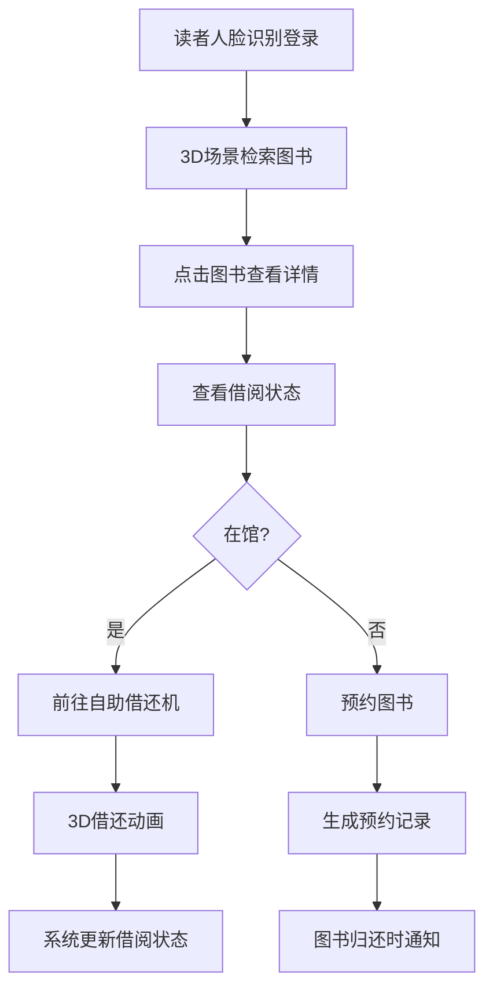
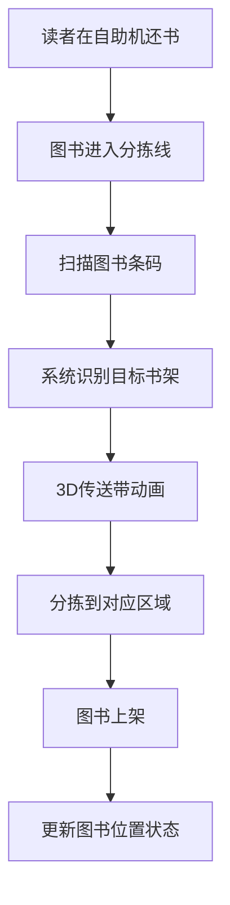
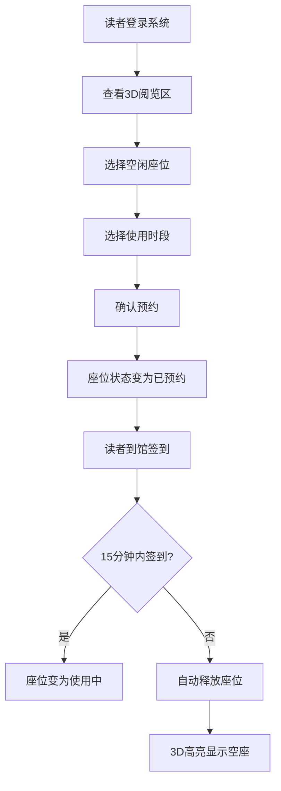
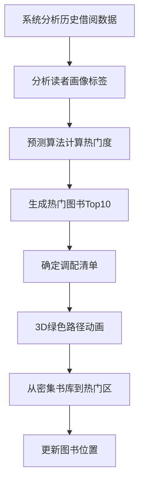

## 1. 产品概述

3D智慧图书馆运营调度与读者服务可视化平台，通过三维建模与实时数据可视化技术，实现图书馆全场景智能化管理与读者服务一体化。整合图书管理、座位预约、环境监测、安全应急等核心功能，为读者提供沉浸式服务体验，为馆员提供高效运营工具，为馆长提供全局决策支持。

- 解决传统图书馆管理效率低下、信息不透明、读者服务体验单一等问题
- 面向读者、馆员、馆长三类用户，实现智慧化、可视化、一体化的图书馆运营管理

## 2. 核心功能

### 2.1 用户角色

| 角色 | 注册方式 | 核心权限 |
|------|---------|---------|
| 读者 | 人脸识别/身份证注册 | 图书检索与借阅、座位预约、借阅历史查询、预约记录查看、应急疏散导航 |
| 馆员 | 人脸识别/工号登录 | 图书上架/下架、借还操作、设备监控、工单处理、盘点管理 |
| 馆长 | 人脸识别/管理员账号 | 全局数据监控、运营报表查看、人员管理、系统配置、应急指挥 |

### 2.2 功能模块

1. **3D可视化主场景**：书架区、阅览区、自助借还机、图书分拣线、监控中心五大区域实时展示
2. **图书信息管理**：书名、作者、借阅状态、架层显示，点击查看借阅历史和预约记录
3. **智能分拣系统**：还书时传送带3D分拣动画，自动分拣到对应书架
4. **书架容量监控**：超限时模型变红并提示整理
5. **座位预约系统**：在线预约、超时15分钟自动释放、3D高亮空座
6. **热门图书预测**：基于历史借阅和读者画像，预测未来一周热门图书，绿色路径动画展示调配
7. **环境监测系统**：温湿度、光照监测，超阈值自动调节空调和灯光，推送通知
8. **盘点机器人**：按路线自主移动，发现错架书生成上架工单
9. **权限管理系统**：三级权限控制，人脸识别登录，操作日志记录
10. **应急疏散系统**：一键启动，3D生成绿色逃生路径和橙色救援路径
11. **运营日报系统**：按日期导出Excel，含借阅量、座位利用率、错架率、设备故障统计

### 2.3 页面详情

| 页面名称 | 模块名称 | 功能描述 |
|---------|---------|---------|
| 登录页 | 人脸识别登录 | 摄像头采集人脸，匹配用户角色，记录登录日志 |
| 3D主场景 | 场景漫游 | 鼠标拖拽旋转、滚轮缩放、点击交互，五大区域实时可视化 |
| 3D主场景 | 书架区 | 多层书架模型，每本书显示信息，超限变红告警 |
| 3D主场景 | 阅览区 | 座位状态实时显示，支持点击预约/签到，超时高亮释放 |
| 3D主场景 | 自助借还机 | 3D设备模型，显示操作状态，可触发借还流程 |
| 3D主场景 | 图书分拣线 | 传送带动画，图书分拣路径可视化 |
| 3D主场景 | 监控中心 | 数据大屏，显示实时运营数据、环境指标、设备状态 |
| 图书详情弹窗 | 基本信息 | 书名、作者、ISBN、出版社、出版日期、所在架层 |
| 图书详情弹窗 | 借阅状态 | 在馆/已借出/预约中，显示预计归还时间 |
| 图书详情弹窗 | 借阅历史 | 历史借阅人、借阅时间、归还时间列表 |
| 图书详情弹窗 | 预约记录 | 当前预约人、预约时间、预约状态列表 |
| 座位预约面板 | 座位选择 | 3D场景联动，高亮可选座位，显示使用时段 |
| 座位预约面板 | 预约管理 | 我的预约、签到、取消预约操作 |
| 环境监测面板 | 实时数据 | 温湿度、光照强度、PM2.5实时曲线图 |
| 环境监测面板 | 设备控制 | 空调开关、温度调节、灯光亮度调节手动控制 |
| 设备控制 | 自动模式 | 阈值设置，超阈值自动调节，3D灯光渐暗动画 |
| 盘点监控面板 | 机器人状态 | 当前位置、盘点进度、电量状态、路线显示 |
| 盘点监控面板 | 错架工单 | 错架图书列表、当前位置、目标位置、处理状态 |
| 热门预测面板 | 预测结果 | 未来一周热门图书Top10，预测借阅量 |
| 热门预测面板 | 调配动画 | 从密集书库到热门区的绿色路径流动动画 |
| 应急指挥面板 | 疏散启动 | 一键启动应急疏散，播放警报，生成路径 |
| 应急指挥面板 | 路径显示 | 绿色逃生路径（读者）、橙色救援路径（工作人员） |
| 运营日报 | 日报查询 | 按日期选择，查看当日运营数据 |
| 运营日报 | 数据统计 | 各区域借阅量、座位利用率、图书错架率、设备故障统计 |
| 运营日报 | Excel导出 | 一键导出日报数据为Excel文件 |
| 系统设置 | 权限管理 | 用户角色配置、权限分配 |
| 系统设置 | 日志查询 | 登录日志、操作日志、告警日志 |

## 3. 核心流程

### 3.1 图书借阅流程

### 3.2 还书分拣流程

### 3.3 座位预约流程

### 3.4 热门图书调配流程

## 4. 用户界面设计

### 4.1 设计风格

- **主色调**：深蓝色 `#1e3a5f`（科技感、专业），搭配天蓝色 `#3b82f6`（交互、高亮）
- **辅助色**：绿色 `#10b981`（正常、安全、逃生路径），橙色 `#f59e0b`（告警、救援路径），红色 `#ef4444`（危险、超限）
- **中性色**：深灰 `#1e293b`，中灰 `#64748b`，浅灰 `#f1f5f9`
- **按钮风格**：圆角8px，带轻微阴影，hover时有上浮动画，active时有按压效果
- **字体**：标题使用 `Noto Sans SC Bold`，正文使用 `Noto Sans SC Regular`，数字使用 `JetBrains Mono`
- **布局风格**：左侧3D主场景（占75%），右侧信息面板（占25%），顶部导航栏，底部状态栏
- **图标风格**：线性图标 `lucide-react`，统一24px尺寸，颜色与主题一致

### 4.2 页面设计概述

| 页面名称 | 模块名称 | UI Elements |
|---------|---------|-------------|
| 登录页 | 人脸识别区域 | 居中圆形摄像头取景框，半透明玻璃态背景，科技感扫描线动画，下方登录按钮 |
| 登录页 | 角色选择 | 三个角色卡片，hover时放大高亮，选中时有边框发光效果 |
| 3D主场景 | 场景区域 | 深色背景，3D图书馆模型，聚光灯光效，环境光遮蔽，鼠标悬停高亮可交互物体 |
| 3D主场景 | 顶部导航 | 半透明深色导航栏，左侧Logo，中间页面标题，右侧用户信息、通知、设置按钮 |
| 3D主场景 | 右侧面板 | 可折叠侧边面板，标签页切换，卡片式布局，滚动条美化 |
| 3D主场景 | 底部状态栏 | 半透明深色栏，左侧显示连接状态、帧率，中间显示当前时间，右侧显示环境指标 |
| 信息弹窗 | 图书详情 | 毛玻璃背景，圆角16px，阴影层次感，分栏布局，标签页切换历史/预约 |
| 信息弹窗 | 环境监测 | 实时曲线图，数据卡片网格，阈值告警线，控制按钮组 |
| 信息弹窗 | 运营日报 | 数据表格，统计图表，导出按钮固定在右上角 |
| 应急模式 | 全屏覆盖 | 红色闪烁边框，警报图标动画，路径高亮闪烁，紧急联系信息 |

### 4.3 响应式

- **桌面端优先**：1920×1080及以上分辨率，3D场景占据主要屏幕空间
- **平板适配**：1024×768以上，右侧面板改为底部抽屉式，触控手势支持旋转缩放
- **移动端**：768以下，简化3D场景为关键区域缩略图，主要功能以列表形式呈现

### 4.4 3D场景指导

- **环境/HDRI和氛围**：使用室内HDRI环境贴图，模拟图书馆柔和自然光，整体暖色调，营造安静舒适的阅读氛围
- **灯光设置**：主方向光模拟天窗自然光，强度0.6；补光模拟室内顶灯，强度0.4；区域光模拟台灯，强度0.3；阴影开启软阴影，分辨率2048
- **相机设置和运动**：初始位置(0, 8, 15)，看向原点；使用OrbitControls，限制俯仰角10°-85°，最小距离5，最大距离50；阻尼系数0.05，平滑旋转
- **构图和焦点元素**：书架区作为主视觉中心，位于场景中央；阅览区在左侧，自助借还机在右前方，分拣线在后方，监控中心在右上角
- **交互和动画**：
  - 图书悬停时上浮5mm并高亮发光
  - 点击图书时弹出信息面板，图书持续微亮
  - 分拣动画：图书沿传送带移动，速度0.5m/s，到位后有轻微弹跳
  - 调配路径：绿色光柱沿路径流动，循环动画，速度2s/周期
  - 应急路径：绿色/橙色线条沿路径闪烁，间隔1s
  - 超限书架：红色呼吸灯效果，频率2s/周期
  - 盘点机器人：沿路径平滑移动，速度0.3m/s，顶部指示灯闪烁
- **后处理效果**：Bloom泛光效果（强度0.3），轻微晕影，色彩校正（饱和度1.1，对比度1.05）
- **资源来源和性能预算**：所有3D模型程序化生成，不使用外部资源；总三角形数控制在20万以内；Draw Call控制在100以内；帧率目标60fps
