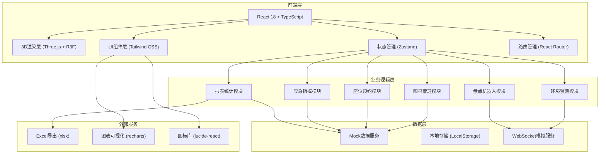
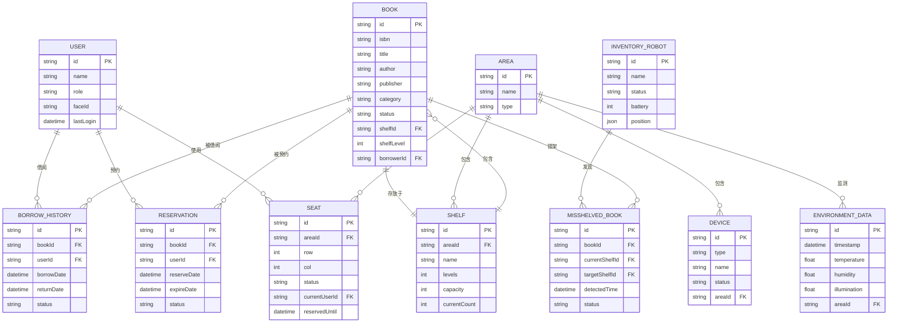

## 1. 架构设计



## 2. 技术描述

### 2.1 核心技术栈

- **前端框架**: React@18.2.0 + TypeScript@5.4.0
- **构建工具**: Vite@5.2.0
- **3D渲染**: 
  - three@0.162.0
  - @react-three/fiber@8.15.16
  - @react-three/drei@9.99.0
  - @react-three/postprocessing@2.16.0
- **状态管理**: zustand@4.5.2
- **路由**: react-router-dom@6.22.3
- **样式**: tailwindcss@3.4.1
- **UI组件**: lucide-react@0.363.0
- **图表**: recharts@2.12.3
- **Excel导出**: xlsx@0.18.5
- **后端**: 无（纯前端Mock数据）

### 2.2 项目初始化

- **初始化工具**: vite-init
- **模板**: react-ts
- **包管理器**: pnpm（优先）/ npm

## 3. 路由定义

| 路由 | 页面 | 权限要求 | 说明 |
|------|-----|---------|-----|
| `/login` | 登录页 | 公开 | 人脸识别登录，角色选择 |
| `/` | 3D主场景 | 读者/馆员/馆长 | 图书馆3D可视化主界面 |
| `/books` | 图书管理 | 馆员/馆长 | 图书列表、借阅管理 |
| `/seats` | 座位管理 | 读者/馆员 | 座位预约、签到管理 |
| `/environment` | 环境监测 | 馆员/馆长 | 温湿度、光照监测与控制 |
| `/inventory` | 盘点管理 | 馆员/馆长 | 盘点机器人监控、错架工单 |
| `/analytics` | 数据分析 | 馆长 | 热门预测、运营报表 |
| `/emergency` | 应急指挥 | 馆长 | 疏散启动、路径管理 |
| `/settings` | 系统设置 | 馆长 | 权限管理、日志查询 |

## 4. API 定义

### 4.1 TypeScript 类型定义

```typescript
// 用户类型
interface User {
  id: string;
  name: string;
  role: 'reader' | 'librarian' | 'director';
  avatar?: string;
  faceId?: string;
  lastLogin?: Date;
}

// 图书类型
interface Book {
  id: string;
  isbn: string;
  title: string;
  author: string;
  publisher: string;
  publishDate: string;
  category: string;
  location: {
    shelfId: string;
    shelfLevel: number;
    position: number;
  };
  status: 'available' | 'borrowed' | 'reserved' | 'misshelved';
  borrowerId?: string;
  dueDate?: string;
  coverColor: string;
}

// 借阅历史
interface BorrowHistory {
  id: string;
  bookId: string;
  userId: string;
  borrowDate: string;
  returnDate?: string;
  status: 'active' | 'returned' | 'overdue';
}

// 预约记录
interface Reservation {
  id: string;
  bookId: string;
  userId: string;
  reserveDate: string;
  expireDate: string;
  status: 'pending' | 'fulfilled' | 'expired' | 'cancelled';
}

// 座位类型
interface Seat {
  id: string;
  areaId: string;
  row: number;
  col: number;
  status: 'available' | 'reserved' | 'occupied' | 'maintenance';
  currentUserId?: string;
  reservedUntil?: string;
  checkInDeadline?: string;
}

// 环境数据
interface EnvironmentData {
  timestamp: string;
  temperature: number;
  humidity: number;
  illumination: number;
  pm25: number;
  areaId: string;
}

// 设备状态
interface Device {
  id: string;
  type: 'ac' | 'light' | 'kiosk' | 'conveyor';
  name: string;
  status: 'on' | 'off' | 'error';
  value?: number;
  areaId: string;
}

// 盘点机器人
interface InventoryRobot {
  id: string;
  name: string;
  status: 'idle' | 'scanning' | 'returning' | 'charging';
  battery: number;
  position: { x: number; y: number; z: number };
  currentPath: { x: number; y: number; z: number }[];
  progress: number;
  misshelvedBooks: MisshelvedBook[];
}

// 错架图书
interface MisshelvedBook {
  id: string;
  bookId: string;
  currentShelfId: string;
  targetShelfId: string;
  detectedTime: string;
  status: 'pending' | 'processing' | 'resolved';
}

// 运营日报
interface DailyReport {
  date: string;
  borrowCount: Record<string, number>;
  seatUtilization: number;
  misshelveRate: number;
  deviceFailures: {
    deviceId: string;
    type: string;
    description: string;
    time: string;
  }[];
  totalBorrows: number;
  totalReturns: number;
  newReservations: number;
}

// 紧急事件
interface EmergencyEvent {
  id: string;
  type: 'fire' | 'earthquake' | 'security';
  startTime: string;
  status: 'active' | 'resolved';
  escapeRoutes: { points: { x: number; y: number; z: number }[] }[];
  rescueRoutes: { points: { x: number; y: number; z: number }[] }[];
}

// 热门图书预测
interface HotBookPrediction {
  bookId: string;
  book: Book;
  predictedBorrows: number;
  confidence: number;
  currentLocation: string;
  targetLocation: string;
  transferStatus: 'pending' | 'in_transit' | 'completed';
}
```

### 4.2 Mock API 接口

```typescript
// 认证接口
interface AuthAPI {
  loginWithFaceId(faceData: Blob): Promise<User>;
  loginWithCredentials(username: string, password: string): Promise<User>;
  logout(): Promise<void>;
  getCurrentUser(): Promise<User | null>;
}

// 图书接口
interface BookAPI {
  getBooks(page?: number, pageSize?: number): Promise<Book[]>;
  getBook(id: string): Promise<Book>;
  getBorrowHistory(bookId: string): Promise<BorrowHistory[]>;
  getReservations(bookId: string): Promise<Reservation[]>;
  borrowBook(bookId: string, userId: string): Promise<Book>;
  returnBook(bookId: string): Promise<Book>;
  reserveBook(bookId: string, userId: string): Promise<Reservation>;
  updateBookLocation(bookId: string, shelfId: string, level: number): Promise<Book>;
}

// 座位接口
interface SeatAPI {
  getSeats(areaId?: string): Promise<Seat[]>;
  reserveSeat(seatId: string, userId: string, duration: number): Promise<Seat>;
  checkInSeat(seatId: string, userId: string): Promise<Seat>;
  cancelReservation(seatId: string): Promise<Seat>;
  getUserReservations(userId: string): Promise<Seat[]>;
}

// 环境接口
interface EnvironmentAPI {
  getCurrentData(areaId?: string): Promise<EnvironmentData>;
  getHistoricalData(startDate: string, endDate: string): Promise<EnvironmentData[]>;
  setDeviceStatus(deviceId: string, status: 'on' | 'off', value?: number): Promise<Device>;
  getDevices(): Promise<Device[]>;
  setThresholds(type: 'temperature' | 'humidity' | 'illumination', min: number, max: number): Promise<void>;
}

// 盘点接口
interface InventoryAPI {
  getRobots(): Promise<InventoryRobot[]>;
  startInventory(robotId: string): Promise<InventoryRobot>;
  stopInventory(robotId: string): Promise<InventoryRobot>;
  getMisshelvedBooks(): Promise<MisshelvedBook[]>;
  resolveMisshelved(id: string): Promise<MisshelvedBook>;
}

// 报表接口
interface ReportAPI {
  getDailyReport(date: string): Promise<DailyReport>;
  getHotPredictions(weeks: number): Promise<HotBookPrediction[]>;
  exportDailyReport(date: string): Promise<ArrayBuffer>;
}

// 应急接口
interface EmergencyAPI {
  startEmergency(type: 'fire' | 'earthquake' | 'security'): Promise<EmergencyEvent>;
  stopEmergency(eventId: string): Promise<EmergencyEvent>;
  getActiveEmergency(): Promise<EmergencyEvent | null>;
}
```

## 5. 数据模型

### 5.1 ER 图



### 5.2 Mock 数据初始化

项目启动时初始化以下Mock数据：

- **用户数据**: 50名读者、5名馆员、1名馆长
- **图书数据**: 500本图书，涵盖10个分类，分布在20个书架
- **书架数据**: 20个书架，每个5层，每层容量20本
- **座位数据**: 100个座位，分布在5个阅览区
- **设备数据**: 10台空调、20组灯光、4台自助借还机、1条分拣线
- **历史数据**: 过去30天的借阅记录、环境数据、运营日志
